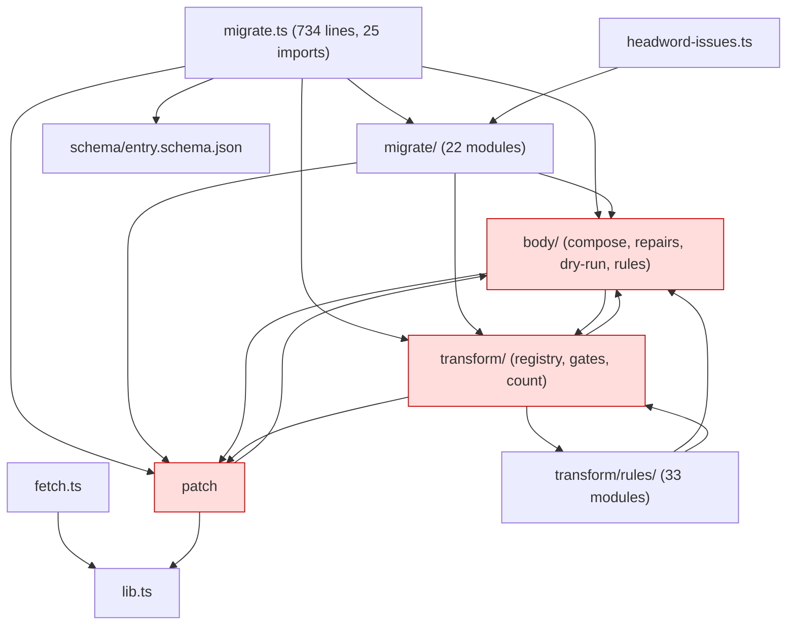

# Structure / architecture / repo-hygiene review — `v2` at `12a40a30` (2026-09-20)

Read-only review. Tags `[sev]` `[conf]`. Every claim cites a path; counts measured this session.

## Executive summary

1. **Nothing junk is tracked**, but 828 MB of dead worktrees sit under `.claude/worktrees/` (3 registered on merged commits + 1 orphan), and 11 of 13 local branches plus 5 remote branches are squash-merged and deletable. `[sev:med]`
2. **Root and config files still describe v1**: `README.md` (`data/raw/`, removed app's feature list), `SECURITY.md` (`data/admin/`), `CONTRIBUTING.md` (a 300-line `data/**` CI guard and `bulk-data-ok` label no workflow implements), `.github/PULL_REQUEST_TEMPLATE.md` (links a deleted checklist, says `biome check .`), `biome.json` (v1 browser globals, `data/admin/annotations.json`), `.coderabbit.yaml` (`assets/scripts/**`), `renovate.json` (watches root `index.html`), `tsconfig.json` comment, `.claude/CLAUDE.md` (Tech Stack half-empty, v1 fonts/icons). `[sev:med]`
3. **Of 20 specs, 4 are canonical** (overhaul, data-architecture, migrate, consolidation) plus `docs/glossary.md`; 4 are superseded/historical in whole (sense-structure, research-process, sweep-tiering, body-model as a design record); 12 are dated batch/gate-case records still holding live rulings. No historical one carries a supersession banner. `[sev:med]`
4. **Six struck rulings survive in satellites** with no pointer: the 2026-08-27 paren-strip ruling (reversed 2026-09-20) in `admin/pipeline/transform/rules/headword.ts:135` and headword-field spec §3.2/§7.1; "slug frozen at import" (amended to "at publication") in data-architecture D12, migrate spec §2.4 and `docs/glossary.md`; the golden render diff (replaced 2026-09-06) in sweep-tiering §2/§3.2; `CONFIRMED_NO_CHANGE` (retired by S6) in consolidation §4.1 and `data/patches/reviewed/README.md`; migrate spec §6's corpus tests (deleted step 5) and its `worktree-headword-page-index` branch (gone). `[sev:high]`
5. **Rulings C–F exist only as docstrings** in `admin/pipeline/patch/apply.ts`; the "task-3 addendum" documents they cite are not in the repository nor at the archive tag. Rulings A and B have no trace anywhere. `[sev:high]`
6. **Three decisions are recorded as live but not in code**: `phrase-alt-headword-stub` stops expanding (still registered, `transform/registry.ts:951`), NFC-on-write (#110), headword perfect-or-halt (still a `blocks` review row, not a fault). R3 and R11 acknowledged unbuilt; the D14-era empty-tree guard is live (`migrate.ts:580`). `[sev:med]`
7. **Code is organised by history, not the three-bucket model**: `body/types.ts` is the shared model everything imports (60+ edges), `body/compose.ts` is the orchestrator in the lowest-named directory, review detectors have no directory, `body/dry-run.ts` survives because `migrate.ts` imports one helper. Directory-level cycle `body ↔ patch ↔ transform`. `[sev:med]`
8. **`docs/v2/research-backlog.md` not imported into the tracker** (R7/§10); `docs/v2/test-tiers.md` fully superseded, belongs in archive. `[sev:med]`
9. **CI/config internally consistent**; `htmlparser2` unused devDependency; `ci-lint.yml` `workflow_call` with no caller; harden-runner pinned at two versions. `[sev:low]`
10. **Decision record**: 9 id schemes, ~80 rulings tabulated in §5 — 6 duplicated in different wording, 6 reversed-but-cited-live, 10 not-reflected-in-code.

## 1. Repo layout

### 1.1 Directory map
| Path | Files | Purpose | State |
|---|---|---|---|
| `.claude/CLAUDE.md` | 1 | guidance | Tech Stack stale |
| `.github/` | 11 | CI, templates | live, v1 wording in templates |
| root configs | 10 | toolchain | v1 residue |
| root docs | 6 | project docs | v1 wording |
| `app/index.html` | 1 | Cloudflare placeholder | stub |
| `admin/pipeline/` root | 6 | fetch, migrate, headword-issues, lib | `headword-issues.ts` is reporting, not a stage |
| `admin/pipeline/body/` | 41 | body rules, composer, dry-run | `types.ts`/`compose.ts` mis-homed |
| `admin/pipeline/migrate/` | 56 | stages, gates, report, slug index | hosts review detectors with no marker |
| `admin/pipeline/patch/` | 18 | patch engine | ok |
| `admin/pipeline/transform/` | 97 | registry, rules, gates, count | `count.ts` is test-tier audit |
| `admin/pipeline/page-index/` | 3 | hebrew.ts, verify.ts | verify dead on v2 |
| `data/patches/` | 67 | pilot, tranches, reviewed, patterns, RUNBOOK | RUNBOOK historical |
| `docs/specs/` | 20 | specs | mixed |
| `docs/superpowers/plans/` | 33 | finished plans + sidecars | archive |
| `docs/v2/` | 11 | generated + hand-written | `test-tiers.md` → archive |
| `docs/archive/` | 180 | retired research | ok |

### 1.2 Ignores and scratch
- No tracked `.DS_Store`/`.bkp`. `.gitignore` covers `.cache/`, `.superpowers/`, `.usage-mark`, `.work/`, `.$*.bkp`; `.claude/worktrees/` via `.git/info/exclude`. `.remember/` ignore source unconfirmed in-sandbox.
- `.work/` (step-5 verifier + classifier output, already recorded in the step-5 plan), `.usage-mark`, `.superpowers/` are dead scratch — delete.

### 1.3 Branches (content-checked: does any touched file still differ from v2?)
| Branch | Verdict |
|---|---|
| `main` | keep |
| `claude/blissful-hopper-32830f`, `claude/dreamy-maxwell-ca10bc`, `claude/inspiring-tereshkova-23d11c`, `claude/ocr-error-logging-7f427a`, `claude/pipeline-consolidation-design-8fa09c`, `claude/pipeline-consolidation-design-c8c4d8` | delete — six aliases of `main`'s tip |
| `claude/biome-resolve-via-bun` (#101), `claude/consolidation-step9` (#99), `claude/consolidation-step10` (#100), `claude/peaceful-spence-96b9bc` (#84), `research/implied-n-census` (#83) | delete — merged |
| `archive/v2-research-2026-09` | keep; name collides with the tag (`refname is ambiguous`) |
| remote `chore/sync-main-to-v2`, `claude/blissful-lamarr-eeac3e`, `claude/headword-processor-issues-b667f8`, `new/edit-mining`, `research/residue-calibration` | delete remote — all merged/closed, 0 files differ |

### 1.4 Worktrees (828 MB)
`blissful-hopper-32830f` (ce4e98ac, #101), `ocr-error-logging-7f427a` (2ec3aefc), `pipeline-consolidation-design-c8c4d8` (d4aca7c9, #99) — all detached, clean, merged → remove. `headword-processor-issues-b667f8` — orphan dir, not registered → `rm -rf`. Run unsandboxed (memory: sandbox blocks `.git/config` writes).

## 2. Docs

### 2.1 Specs (20)
| Spec | State | Recommendation |
|---|---|---|
| overhaul (07-03) | canonical; CP-2a/CP-2 never recorded; links `2026-06-04-contribution-readiness.md` which exists on `main` only | keep; fix link |
| data-architecture (07-08) | canonical; D12 and D2 not amended | keep; amend |
| entry-body-model (07-11) | implemented | keep |
| sense-structure-repair (08-06) | superseded: S1/S2 → patches, S5 deleted, S6 name still used; cites gone branch | **archive** with note |
| research-process (08-10) | historical; live parts restated elsewhere | **archive** with note |
| sweep-tiering (08-17) | mostly historical; §2/§3.2 still promise golden render diff | **archive** with note |
| transform-module (08-22) | live contract | keep |
| 7 batch designs | dated records holding live rulings; headword-field §3.2/§7.1 paren ruling reversed with no pointer; 3 broken links | keep + status banner + reversal pointer |
| 4 gate-case specs | live | keep |
| migrate (09-06) | canonical but stale: §2.1 "expanded geresh stubs", §2.4 "frozen", §6 lists deleted corpus tests, header names gone branch | keep; amend |
| consolidation (09-13) | canonical, complete | keep |

### 2.2 Plans
18 plans + 14 sidecars, all finished (one sidecar stale `in_progress`). Recommend `git mv docs/superpowers/plans docs/archive/plans`, rewrite 3 links, drop `biome.json:16`.

### 2.3 `docs/v2/`
| File | Generated? | State |
|---|---|---|
| `migration-blessing.md` | yes (`migrate/report.ts:8`) | live |
| `review-report.md` | yes (`migrate/review-report.ts:6`) | live: 302 blocks / 2,204 defer / 7 note |
| `headword-issues.md/.csv` | yes (`headword-issues.ts`) | live |
| `headword-design.md` | hand | live, "proposed, not final" |
| `research-backlog.md` | hand | live; **not imported to tracker** |
| `retired-corpus-checks.md` | hand | live work list |
| `test-tiers.md` | hand | superseded → archive |
| `sefaria-report.md`, `upstream-issues.md` | hand | live; sending is the maintainer's |
| `url-routes.md` | hand | live |

### 2.4 Diagrams
`docs/Migrate Flow.drawio` is Brian's sketch (untracked since #85) — archive or label. `docs/pipeline-flow.drawio.svg` omits `data/slug-index/` as an input (`grep -c slug` = 0).

### 2.5 Glossary consistency breaks
`README.md:27` `data/raw/`; `SECURITY.md:16` `data/admin/`; `tsconfig.json:5`; `biome.json:14`; `body/README.md:9` "Not part of the pipeline proper" (stale); glossary's slug row says "frozen at import" (stale vs R10).

### 2.6 Root docs / GitHub metadata
`README.md` describes the removed v1 app. `CONTRIBUTING.md` promises a `data/**` 300-line CI guard + `bulk-data-ok` label — no workflow implements it; `data-correction.yml:10` points to a CONTRIBUTING section that does not exist. `SECURITY.md` v1 scope. `PULL_REQUEST_TEMPLATE.md` links deleted `docs/accessibility-checklist.md`, says `biome check .`. `bug.yml:23` v1 routes.

### 2.8 data READMEs
`data/page-index/README.md:7` cites archived `build.ts`, `:148` v1 JSONL. `data/patches/reviewed/README.md` uses retired "Confirmed no change". `data/patches/RUNBOOK.md`: procedure with no runnable tool (says so 7×) but holds three live rulings (2026-08-15 cadence, triage default, wrong-reference handling) → lift rulings, archive. `patterns.jsonl`: 38 `reason` fields cite moved `catalogue-audit/*.md`.

### 2.9 Broken links
```
.github/PULL_REQUEST_TEMPLATE.md -> ../docs/accessibility-checklist.md
data/patches/tranches/batch-02-2026-09-04/README.md -> ../../../docs/archive/phase-2-batch-02-breach.md (one ../ short)
docs/specs/2026-07-03-v2-overhaul-design.md -> 2026-06-04-contribution-readiness.md
docs/specs/2026-08-27-headword-field-integrity-design.md -> ../../data/patches/catalogue-audit/*.md (x3)
```

### 2.10 Stale references to archived code
`admin/pipeline/provenance/baseline-transform.ts` cited by `body/types.ts:10`, `transform/no-new-text.ts:80`, `body/README.md:51`; `research/patterns.ts` by three batch specs; `page-index/build.ts` by `data/page-index/README.md:7`.

## 3. Architecture

### 3.1 Dependency graph (directory level)

Edge counts: `rules→transform` 86, `rules→body` 35, `transform→rules` 32, `transform→body` 12, `patch→body` 6, `transform→patch` 4, `body→transform` 3, `body→patch` 2. No file-level cycle (Biome `noImportCycles` passes); directory-level cycle is real.

### 3.2 Findings
- `[med]` `body/types.ts` is the shared model, mis-homed (60+ edges). Move to `admin/pipeline/types.ts` by `git mv` + sed.
- `[med]` `body/compose.ts` is the orchestrator; imports patch and transform; `apply-cli.ts:7-10` documents living beside `apply.ts` to dodge the cycle.
- `[med]` Three buckets (R4) not visible in the tree. Review detectors (`migrate/headword.ts`, `page.ts`, `markup.ts`, `slug-index.ts`, `orphan-refs.ts`) mixed with stages and gates.
- `[med]` `body/dry-run.ts` + `dry-run-verify.ts` + `dry-run-report.ts` (888 lines of one-shot CLI) on the import path because `migrate.ts` imports `buildTrace`. Extract to `body/trace.ts`, archive the trio.
- `[low]` `transform/link-target.ts` imports `transform/rules/point-claims.ts` — a gate depending on rules.

### 3.3 Edge scripts
| Script | package.json | Recommendation |
|---|---|---|
| `headword-issues.ts` | `headword:issues` | keep until headword work lands; move out of pipeline root |
| `page-index/verify.ts` | `pageindex:verify` | archive (needs v1 `--prior` data) |
| `body/dry-run*.ts` | `body:dry-run` | extract `buildTrace`, archive |
| `transform/count.ts` | `transform:count` | keep as local audit or archive |
| `patch/apply-cli.ts` | `patch:replay` | keep |
| `migrate/seed-slug-index.ts` | none | archive |

## 4. CI / config
`package.json` consistent with CLAUDE.md; `htmlparser2` unused. `ci-lint.yml` `workflow_call` no caller; harden-runner v2.17.0 vs v2.15.0. `biome.json` `!data/admin/annotations.json` + ten v1 globals. `renovate.json` `customManagers[0]` watches `/^index\.html$/`. `wrangler.jsonc` `$schema` → uninstalled package. `.coderabbit.yaml` `assets/scripts/**`.

## 5. Decision record (abridged; nine id schemes)

### Reversed but still cited live
| Ruling | Reversed by | Still cited in |
|---|---|---|
| 08-27 paren strip | headword-design §4 (09-20) | `rules/headword.ts:135`, headword-field §3.2/§7.1, `registry.ts:933` `[high]` |
| slug frozen at import (D12) | R10 amended 09-18 | D12, migrate §2.4, glossary `[med]` |
| golden render diff | migrate §1 (09-06) | sweep-tiering §2/§3.2 `[med]` |
| `CONFIRMED_NO_CHANGE` | S6 | consolidation §4.1, `reviewed/README.md` `[low]` |
| corpus tests | step 5 | migrate §6 `[low]` |
| archived tools / gone branches | steps 5–6 | sweep-tiering §3.1, research-process §8, migrate header, sense-structure §8 `[low]` |

### Decided but not in code
R3 (emit from source bytes), R11 (atomic write), D9 (pointer entries), D15, headword perfect-or-halt, `phrase-alt-headword-stub` stop (rule still registered `registry.ts:951`, phase `text-repairs`), per-form gender / `display` / `partial`, NFC on write, S4 (3 rids still `needs_human_judgment`), S6. Only phrase-stub and the paren reversal are live rules running against a ruling.

### Lettered rulings C–F
Exist only as `patch/apply.ts` docstrings; C = one manifest record per rid, latest wins; D = `needs_*` blocks replay, import defers; E = tranches carry a stage, import accepts `healed` only; F = pre-patch patches carry over unless covered. Cited "task-3 addendum" not in repo or archive tag; A/B no trace. First appearance `106960c0` (#73, 2026-09-09).

### Same ruling, different wording
Slug freeze (import vs publication); no-new-text (four layers; agents already remove bytes via 7 delete patches while the 09-18 ruling says they cannot); escalation default (08-15 / T6 / 09-20); `migrate.ts` lifetime (prose says permanent, `outputTreeIsEmpty` enforces the struck one-shot); parens; model tier.

Other: V5 superseded, V6/V7 CP-2a never recorded, V9 dormant; D2 contradicted by committed `build-report.json`; D10 `bun validate` script doesn't exist; D14 struck with pointers but guard lives (`migrate.ts:575-580`).

## 6. Cleanup actions

### 6.1 Safe mechanically
1. Worktrees: remove three registered + `rm -rf` orphan; `git worktree prune` (unsandboxed). 828 MB.
2. `git branch -D` 11 local branches (list §1.3).
3. Delete 5 remote branches (§1.3).
4. Delete `.work/`, `.usage-mark`, `.superpowers/`.
5. Fix six broken links (§2.9).
6. `bun remove htmlparser2`.
7. `git mv docs/v2/test-tiers.md docs/archive/`.
8. `git mv docs/superpowers/plans docs/archive/plans`; rewrite 3 links; drop `biome.json:16`.
9. Archive-tag pointers at `body/types.ts:10`, `no-new-text.ts:80`, `body/README.md:51`, `data/page-index/README.md:7,148`.
10. v1 config residue: `biome.json`, `tsconfig.json:5`, `.coderabbit.yaml`, `renovate.json`, `bug.yml:23`, `wrangler.jsonc`.
11. Supersession pointers (one sentence each) at the six satellite sites.
12. Add `data/slug-index/` to `pipeline-flow.drawio.svg`.
13. Rewrite `README.md`, `SECURITY.md`, `CONTRIBUTING.md` size policy for v2.
14. `.claude/CLAUDE.md` Tech Stack → v2.

### 6.2 Needs Brian's decision
1. Branch/tag collision `archive/v2-research-2026-09` — rec: delete the branch.
2. Archive three specs with banners (sense-structure, research-process, sweep-tiering) — rec: move to `docs/archive/specs/`.
3. 12 batch/gate-case specs — rec: keep + status banner.
4. `data/patches/RUNBOOK.md` — archive after lifting three live rulings.
5. `docs/Migrate Flow.drawio` — rec: archive as provenance.
6. **One decisions index** (`docs/decisions.md`): id, date, one line, home, status, what-it-drops. This is #104's deliverable.
7. Rulings C–F: write definitions into the index; declare "task-3 addendum" lost; declare A/B non-existent.
8. Code moves (separate PRs, invariants first): `body/types.ts` → root; `body/compose.ts` → root; extract `buildTrace`; archive dry-run trio, `page-index/verify.ts`; move `headword-issues.ts`.
9. Group review detectors into `migrate/detectors/`.
10. `phrase-alt-headword-stub`: unregister now or with the headword work.
11. Research backlog → tracker now by hand, or wait for admin tool.
12. D2 exceptions: amend D2 to name committed evidence artifacts.
13. CP-2a / V7: record in the overhaul changelog.
14. `ci-lint.yml` `workflow_call`: drop or keep.
15. `patterns.jsonl` 38 stale `catalogue-audit` paths: rewrite to `docs/archive/catalogue-audit/`.
